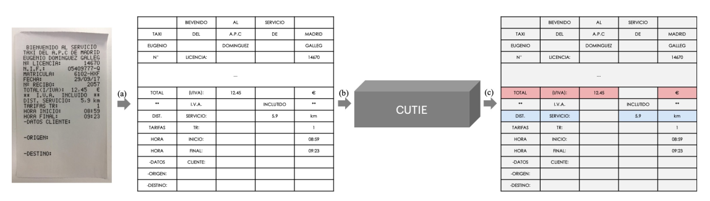

# OCR Receipts to JSON format

### Pré-requis :

```Tesseract``` Version 5 alpha, [here](https://github.com/tesseract-ocr/tesseract)

Install with the tessdata-best  in the right path. The weights to choose are [here](https://tesseract-ocr.github.io/tessdoc/Data-Files.html)
 


in the papper [https://arxiv.org/pdf/1903.12363.pdf](),  9 classes representing key text fields  among them "DontCare", "VendorName"....

In this repository I use 2 classes to label the text fields. they are "DontCare"  for texts theat have not use for us and "TotalCTT" for the text that represents the total amount ctt in each receipt.

### CUTIE  :  The  proposed method in the paper.
First the receipt is scnanned using an OCR Engine (In this code Tesseract 5 is used). Each word is detected and recongnized using the bounding box around it. The position of the word in the image and the word are known, therefore  two  different features are used to train the model; semantical and spatial features.  



### Dataset : 

The link of receipts datasets (200): https://expressexpense.com/blog/free-receipt-images-ocr-machine-learning-dataset/